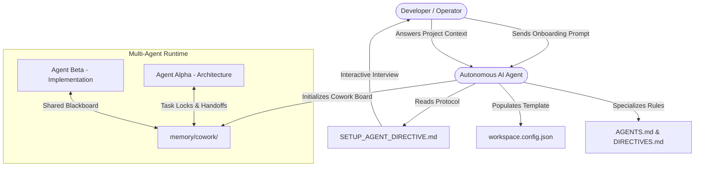

# Agent Workspace OS 🤖

<div align="center">

**The Deterministic Operating Framework for Autonomous AI Software Engineering.**  
*Turn any repository into an hallucination-resistant, multi-agent collaborative environment.*

[](LICENSE)
[](https://github.com/axion-dev-enterprise/agent-workspace-os)
[](CONTRIBUTING.md)
[](#supported-agents)

[Quickstart](#-quickstart-in-60-seconds) • [Core Principles](#-core-principles) • [Multi-Agent Cowork](#-multi-agent-cowork-protocol) • [Architecture](#-architecture) • [Contributing](#-contributing)

</div>

---

## 💡 Why Agent Workspace OS?

Autonomous coding agents (Claude Code, Antigravity, Cursor, Codex, Windsurf, Copilot) are extraordinarily capable, but when dropped into loose codebases without strict rails, they suffer from well-known failure modes:
- **Root Pollution**: Dropping random test scripts and scratch files into the project root.
- **False Positive Affirmations**: Declaring tasks finished without empirical verification.
- **Destructive Concurrency**: When running multiple agents or subagents, they overwrite each other's edits.
- **AI Cliché UIs**: Inundating frontends with purple neon gradients, floating robots and emojis instead of professional UI/UX.

**Agent Workspace OS** solves this by establishing a **file-based deterministic governance protocol**. It provides the strict behavioral boundaries, empirical quality gates, and asynchronous synchronization primitives that production engineering demands.

---

## ⚡ Quickstart (In 60 Seconds)

### 1. Clone this template
```bash
git clone https://github.com/axion-dev-enterprise/agent-workspace-os.git my-project
cd my-project
```

### 2. Open in your favorite AI Editor or CLI
Works out of the box with **Claude Code**, **Antigravity**, **Cursor Composer**, **ChatGPT/Codex**, **Hermes**, or **Windsurf**.

### 3. Send the Magic Prompt to your Agent
Copy and paste this single instruction to your agent:

```text
Hi! Please read SETUP_AGENT_DIRECTIVE.md and conduct the interactive onboarding setup for my workspace.
```

The AI agent will read the protocol, ask you **6 concise questions** (Project Name, Git Identity, Domain, Deploy Target, etc.), atomically replace all placeholders, and configure your repository ready for production!

---

## 🏛️ Architecture & Flow



---

## 🎯 Core Principles

| Principle | Specification |
|---|---|
| **Zero Root Clutter** | Strictly only essential config files permitted in the root directory. Scratch scripts and tests go to isolated canonical directories. |
| **Empirical Verification** | It is strictly forbidden for agents to declare success based solely on status codes. HTML/DOM body inspection and live response validation are mandatory. |
| **Zero Test Pollution** | Automated teardown in `finally` blocks for all test users, orders, and mock data. Zero DB residue. |
| **Big Tech UI/UX Standard** | Total prohibition of emojis as UI icons. Professional SVG vector icons only (Lucide, Heroicons). Obsidian/Zinc surfaces, 150-200ms transitions, CLS = 0. |
| **Custom Modals & Toasts** | Browser-native `alert()`, `confirm()`, and `prompt()` are prohibited. Dark 3D glassmorphic dialogs only. |
| **Multi-Agent Cowork** | Asynchronous coordination via `active_tasks.json` (locks), `blackboard.json` (findings), and formal `handoffs/`. |
| **Mandatory Daily Timeline** | Every action and technical diagnosis is chronologically recorded in `memory/daily_logs/YYYY-MM-DD.md`. |

---

## 📂 Canonical Directory Layout

```
.
├── .github/                    # Issue & Pull Request templates
├── .skills/                    # Modular skills executable by agents
│   ├── cicd-quality-gate/      # 5 Mandatory quality gates (Go / No-Go)
│   ├── multi-agent-cowork/     # Concurrency locks and shared findings
│   ├── post-deploy-verification/# Real DOM and public endpoint auditing
│   ├── ui-anti-cliche-design/  # Big Tech design system specifications
│   └── zero-test-pollution/    # Automated database teardown patterns
├── docs/                       # Technical specifications & ADRs
│   ├── COWORK_PROTOCOL.md      # Multi-agent asynchronous protocol
│   └── WORKSPACE_ORGANIZATION_RULES.md # Structural standards
├── apps/                       # User-facing applications and SPAs
├── services/                   # Backend services, APIs, and background workers
├── packages/                   # Shared monorepo packages and libraries
├── memory/                     # Persistent agent telemetry and coworking
│   ├── daily_logs/             # Chronological work logs (YYYY-MM-DD.md)
│   └── cowork/                 # Active locks, blackboard, and handoffs
├── AGENTS.md                   # The core rulebook governing all AI agents
├── DIRECTIVES.md               # Engineering, CI/CD, and security policies
├── SETUP_AGENT_DIRECTIVE.md    # Interactive onboarding instruction
└── workspace.config.template.json # Template for project variables
```

---

## 🤝 Multi-Agent Cowork Protocol

When scaling from a single agent to a team of specialized subagents, Agent Workspace OS prevents race conditions via an atomic file-based state machine:

1. **Anti-Collision Locks**: Before modifying code in `apps/` or `services/`, the agent registers an exclusive lock in `memory/cowork/active_tasks.json`.
2. **Shared Blackboard**: When an agent discovers a root-cause bug or validates a database schema migration, it publishes a structured note to `memory/cowork/blackboard.json`.
3. **Formal Handoffs**: When transitioning tasks between sessions or agents, a Markdown transition report is archived in `memory/cowork/handoffs/`.

---

## 🛠️ Supported Agents & Tooling

Agent Workspace OS is model-agnostic and runtime-agnostic:
- **Google Antigravity / Gemini CLI**
- **Anthropic Claude Code / Claude Desktop**
- **Cursor IDE (Composer & Background Agents)**
- **OpenAI Codex / ChatGPT CLI**
- **Hermes Agent Suite**
- **GitHub Copilot Workspace**
- **Windsurf Cascade**

---

## 📄 License

This project is open-source software licensed under the [MIT License](LICENSE).
Built with precision for autonomous engineering excellence.
