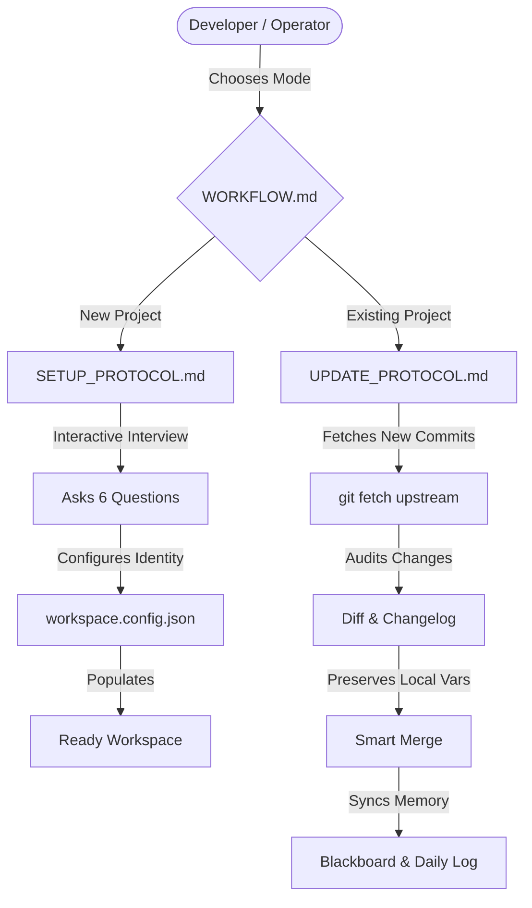

# Agent Workspace OS 🤖

<div align="center">

**The Deterministic Operating Framework for Autonomous AI Software Engineering.**  
*Turn any repository into an hallucination-resistant, multi-agent collaborative environment.*

[](version_dump.json)
[](LICENSE)
[](https://github.com/axion-dev-enterprise/agent-workspace-os)
[](CONTRIBUTING.md)
[](#supported-agents)

[Quickstart](#-quickstart-in-60-seconds) • [Workflows (Setup vs Update)](#-operational-workflows) • [Core Principles](#-core-principles) • [Multi-Agent Cowork](#-multi-agent-cowork-protocol) • [Architecture](#-architecture)

</div>

---

## 💡 Why Agent Workspace OS?

Autonomous coding agents (Claude Code, Antigravity, Cursor, Codex, Windsurf, Copilot) are extraordinarily capable, but without deterministic rails they suffer from well-known failure modes:
- **Root Pollution**: Dropping random test scripts into the root directory.
- **False Positive Affirmations**: Declaring tasks done without empirical validation.
- **Destructive Concurrency**: Overwriting each other's edits during multi-agent sessions.
- **AI Cliché UIs**: Inundating frontends with purple neon gradients, floating robots and emojis.

**Agent Workspace OS** establishes an asynchronous, file-based governance protocol with empirical quality gates, concurrency locks, and automated memory synchronization.

---

## ⚡ Quickstart (In 60 Seconds)

### 1. Clone this template
```bash
git clone https://github.com/axion-dev-enterprise/agent-workspace-os.git my-project
cd my-project
```

### 2. Open in your favorite AI Editor or CLI
Works out of the box with **Claude Code**, **Antigravity**, **Cursor Composer**, **ChatGPT/Codex**, **Hermes**, or **Windsurf**.

### 3. Choose your operational workflow:

#### 🖥️ Visual Web Dashboard & Setup Center (Interactive GUI):
Launch the zero-dependency Python dashboard to inspect environment readiness, scan the WhatsApp QR Code, connect Google Drive, and monitor tasks:
```bash
python scripts/setup_server.py
```
Open your browser at `http://127.0.0.1:8765`.

#### 🚀 For Agent-Guided Conversational Setup:
Copy and paste this instruction to your agent:
```text
Hi! Please execute SETUP_PROTOCOL.md and conduct the interactive onboarding setup for my workspace.
```

#### 🔄 For Incremental Updates (Pull new skills & commits):
When new updates or skills are pushed upstream, tell your agent:
```text
Hi! Please execute UPDATE_PROTOCOL.md to fetch new commits and update context and memory.
```

---

## 🔄 Operational Workflows: Setup vs Update



| Workflow | When to Use | What it Does |
|---|---|---|
| **[SETUP_PROTOCOL.md](SETUP_PROTOCOL.md)** | Fresh clone | Conducts 6-question interview, replaces `{{PLACEHOLDERS}}`, configures Git identity and initializes directory tree. |
| **[UPDATE_PROTOCOL.md](UPDATE_PROTOCOL.md)** | Ongoing workspace | Fetches upstream commits, merges new skills/docs, **preserves 100% of user variables**, and updates memory (`daily_logs/` & `blackboard.json`). |

---

## 🎯 Core Principles

| Principle | Specification |
|---|---|
| **Zero Root Clutter** | Strictly only essential config files permitted in the root directory. Scratch scripts and tests go to isolated canonical directories. |
| **Empirical Verification** | It is strictly forbidden for agents to declare success based solely on status codes. HTML/DOM body inspection and live response validation are mandatory. |
| **Zero Test Pollution** | Automated teardown in `finally` blocks for all test users, orders, and mock data. Zero DB residue. |
| **Big Tech UI/UX Standard** | Total prohibition of emojis as UI icons. Professional SVG vector icons only (Lucide, Heroicons). Obsidian/Zinc surfaces, 150-200ms transitions, CLS = 0. |
| **Custom Modals & Toasts** | Browser-native `alert()`, `confirm()`, and `prompt()` are prohibited. Dark 3D glassmorphic dialogs only. |
| **Multi-Agent Cowork** | Asynchronous coordination via `active_tasks.json` (locks), `blackboard.json` (findings), and formal `handoffs/`. |
| **Mandatory Daily Timeline** | Every action and technical diagnosis is chronologically recorded in `memory/daily_logs/YYYY-MM-DD.md`. |

---

## 📂 Canonical Directory Layout

```
.
├── WORKFLOW.md                 # Master operational router (Setup vs Update)
├── SETUP_PROTOCOL.md           # Step-by-step interactive onboarding protocol
├── UPDATE_PROTOCOL.md          # Step-by-step incremental update & memory sync
├── AGENTS.md                   # Canonical rules governing all AI agents
├── DIRECTIVES.md               # Engineering, CI/CD, and security policies
├── README.md                   # Project overview and documentation
├── workspace.config.template.json # Template for project variables
├── .skills/                    # Modular skills executable by agents
│   ├── cicd-quality-gate/      # 5 Mandatory quality gates (Go / No-Go)
│   ├── multi-agent-cowork/     # Concurrency locks and shared findings
│   ├── post-deploy-verification/# Real DOM and public endpoint auditing
│   ├── ui-anti-cliche-design/  # Big Tech design system specifications
│   ├── zero-test-pollution/    # Automated database teardown patterns
│   ├── whatsapp-monitor-react/ # WhatsApp client bridge (Monitor & React modes)
│   ├── google-drive-sync/      # Google Drive transcripts and docs synchronizer
│   └── environment-preflight-tooling/ # CLI diagnostic and fast dependency installer
├── docs/                       # Technical specifications & ADRs
│   ├── COWORK_PROTOCOL.md      # Multi-agent asynchronous protocol
│   └── WORKSPACE_ORGANIZATION_RULES.md # Structural standards
├── apps/                       # User-facing applications and SPAs
├── services/                   # Backend services, APIs, and background workers
├── packages/                   # Shared monorepo packages and libraries
└── memory/                     # Persistent agent telemetry and coworking
    ├── daily_logs/             # Chronological work logs (YYYY-MM-DD.md)
    └── cowork/                 # Active locks, blackboard, and handoffs
```

---

## 🤝 Multi-Agent Cowork Protocol

When scaling from a single agent to a team of specialized subagents, Agent Workspace OS prevents race conditions via an atomic file-based state machine:

1. **Anti-Collision Locks**: Before modifying code in `apps/` or `services/`, the agent registers an exclusive lock in `memory/cowork/active_tasks.json`.
2. **Shared Blackboard**: When an agent discovers a root-cause bug or validates a database schema migration, it publishes a structured note to `memory/cowork/blackboard.json`.
3. **Formal Handoffs**: When transitioning tasks between sessions or agents, a Markdown transition report is archived in `memory/cowork/handoffs/`.

---

## 🛠️ Supported Agents & Tooling

Agent Workspace OS is model-agnostic and runtime-agnostic:
- **Google Antigravity / Gemini CLI**
- **Anthropic Claude Code / Claude Desktop**
- **Cursor IDE (Composer & Background Agents)**
- **OpenAI Codex / ChatGPT CLI**
- **Hermes Agent Suite**
- **GitHub Copilot Workspace**
- **Windsurf Cascade**

---


---

## 🚀 Changelog

### v1.1.0 (2026-09-14)
- **Setup & Control Dashboard Server v2**: Zero-dependency Python server (`scripts/setup_server.py`) with dark Obsidian/Zinc interface and live SSE streaming installation.
- **WhatsApp Client Bridge**: Dual-mode bridge (Monitor & React) with QR code pairing for listening and dispatching tasks directly from WhatsApp chats.
- **High-Performance Concurrent Preflight**: Parallel tool discovery (`scripts/preflight_check.py`) using `ThreadPoolExecutor` and direct local config inspection (<4.2s).
- **Google Drive Synchronizer**: Direct ingestion of meeting transcripts and Google Docs into workspace memory (`scripts/google_drive_sync.py`).
- **3 New Canonical Skills**: `.skills/whatsapp-monitor-react`, `.skills/google-drive-sync`, and `.skills/environment-preflight-tooling`.
- **Zero Native Dialogs**: Universal dark glassmorphic toast notification system.

## 📄 License

This project is open-source software licensed under the [MIT License](LICENSE).
Built with precision for autonomous engineering excellence.
